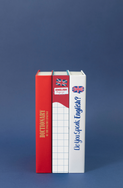

<!DOCTYPE html>
<html lang="en">
<head>
    <meta charset="UTF-8">
    <meta name="viewport" content="width=device-width, initial-scale=1.0">
    <title>Juni Stars</title>
    <link rel="stylesheet" href="style.css">
    <link rel="icon" href="./img/School.png">
    
    
    <link
    rel="stylesheet"
    href="https://cdn.jsdelivr.net/npm/swiper/swiper-bundle.min.css"
  />
</head>
<body>
    

    

        

        
Реєстраційна форма

         
         
    

    

    <label for="name">Ім'я:</label>
    <input type="text" id="name" name="name">

     
    

        <label for="surname">Прізвище:</label>
        <input type="text" id="surname" name="surname">
    

     
    

        <label for="name">Дата народження:</label>
        <input type="date" class="form-control" id="dob" name="dob" required>
    

     
    

        <label for="email">Email:</label>
        <input type="text">
    

     
    

        <label for="number">Номер телефону:</label>
        <input type="text">
    

    
     
    

        <label for="name">День проведення заняття:</label>
        <input type="date" class="form-control" id="dob" name="dob" required>
    

     
    <button class="RegistBut" id="RegistBut">Підтвердити</button>
    

    

Яка у вас мета?

        
Якісь конкретні інтереси?

        
Коли вам буде зручно займатись?

    

    

        

            

<i class="fa-solid fa-money-bill"></i>
Кар'єра і бізнес

             
            

<i class="fa-solid fa-pen"></i>
Уроки для дітей

             
            

<i class="fa-solid fa-pen"></i>
Іспити та навчання

             
            

<i class="fa-solid fa-suitcase"></i>
Культура/подорожі/хобі

             
             
            <button class="TestBoxButton">Підтвердити</button>
        

        

            

Розмовна англійська

             
            

Бізнес англійська

             
            

Англійська інтенсив

             
            

Англійська для початківців

             
             
            <button class="TestBoxButton TestBoxButton2">Підтвердити</button>
        

        

            

Понеділок

             
            

Вівторок

             
            

Середа

             
            

Четвер

             
            

пятниця

             
             
            <button class="TestBoxButton TestBoxButton3">Підтвердити</button>
        

    

    <table>
        <caption>Графік роботи</caption>
        <thead>
          <tr>
            <th>День тиждня:</th>
            <th>Роботчий час:</th>
            <th>Обідня перерва:</th>
          </tr>
        </thead>
        <tr>
          <td>Понеділок</td>
          <td>8:00 - 16:00</td>
          <td>12:00 - 13:00</td>
        </tr> 
        <tr>
          <td>Вівторок</td>
          <td>9:00 - 17:00</td>
          <td>13:00 - 14:00</td>
        </tr>
        <tr>
          <td>Середа</td>
          <td>11:00 - 19:00</td>
          <td>15:00 - 16:00</td>
        </tr> 
        <tr>
          <td>Четверг</td>
          <td>9:00 - 18:00</td>
          <td>13:30 - 14:30</td>
        </tr> 
        <tr>
          <td>П'ятниця</td>
          <td>9:00 - 13:00</td>
          <td>12:00 - 13:30</td>
        </tr> 
        </table>

        <header>
            <a href="#"  style="font-size: 25px; font-weight: 800;">Juni Stars</a>
            

                <a href="#" class="HeadIt lng" onclick="scrollToElement4()">Контакти</a>
                <a href="#" class="HeadIt" onclick="scrollToElement2()">Педагоги</a>
                <a href="#" class="HeadIt"  onclick="scrollToElement1()">Навчання</a>
                <a href="#" class="HeadIt" onclick="scrollToElement5()">Про нас</a>
            

            
        </header>
        

            

            

                

Juni Stars

            

             
            

                
Найуспішніша школа 
                    вивчення іноземної мови
                    у Львові

            

             
            <button onclick="scrollToElement4()">Зателефонувати</button>
             
            <button class="FurstBut2">Фільтр</button>
             
            <button class="FurstBut3">Пройти тест</button>
            <button class="FurstBut4" style="background-color: gray; display: none;">Тест пройдено </button>
            

            

                 
               

Предмет

                
               
Виберіть який предмет ви хочете вивчати

                
               

                

                    

Англійська

                    

Математика

                

                

                    

Українська мова

                    

Література

                

               

            

            

                 
               

Ціна

                
               
Виберіть яка ціна вас влаштує

                
               

                

                    

до 500

                    

до 800

                

                

                    

до 1000

                    

до 1500

                

               

            

            

                 
               

Країна

                
               
Виберіть яка ціна вас влаштує

                
               

                

                    

Україна

                    

Польща

                

                

                    

Англія

                    

США

                

               

            

            

                 
               

Година

                
               
Виберіть коли вам зручно займатися

                
               

                
Вдень:

                 
                

                    

9-12

                    

12-15

                    

15-18

                

                 
                
У вечері і вночі:

                 
                

                    

18-21

                    

21-24

                    

0-3

                

                 
                
Вранці:

                 
                

                    

3-6

                    

6-9

                

               

            

        

    
        

            

                
                 
                
Новітня методика

            

            

                
                 
                
Найкращі вчителі

            

            

                
                 
                
Веселі уроки

            

        

         
        

            
Персоналізація навчання відповідно до інтересів дитини

            

                

                    
                    
Ігри

                     
                    

                    
Дитина обожнює грати в ігри? Нехай тепер це захоплення стане корисним.

                

                <button class="MetodikBoxItemBut">Зарезервувати урок</button>
                <button class="MetodikBoxItemBut2">Скасувати реєстрацію</button>
                

                

                    
                    
Тварини

                     
                    

                    
Дитина любить дізнаватися цікавинки про тварин? Тоді разом з нами вона вирушить вивчати тварин англійською.

                

                <button class="MetodikBoxItemBut">Зарезервувати урок</button>
                <button class="MetodikBoxItemBut2">Скасувати реєстрацію</button>
                

                

                    
                    
Конструктори

                     
                    

                    
У вашій квартирі всюди деталі конструктора? Ваша дитина вивчатиме англійську з LEGO.

                

                <button class="MetodikBoxItemBut">Зарезервувати урок</button>
                <button class="MetodikBoxItemBut2">Скасувати реєстрацію</button>
                

            

            
            

                

                    
                    
Художник

                     
                    

                    
Ваша дитина занурена у малювання ? Давайте спрямуємо цю енергію в корисне! Разом з учителем, вона буде вивчати світ через малювання та англійську мову.

                

                <button class="MetodikBoxItemBut">Зарезервувати урок</button>
                <button class="MetodikBoxItemBut2">Скасувати реєстрацію</button>
                

                

                    
                    
Машинки

                     
                    

                    
Ваша дитина занурена у світ машинок, і місця на полицях вже немає? Давайте використаємо цю енергію продуктивно! 

                

                <button class="MetodikBoxItemBut">Зарезервувати урок</button>
                <button class="MetodikBoxItemBut2">Скасувати реєстрацію</button>
                

                

                    
                    
Музика

                     
                    

                    
Ваша дитина любить слухати музику? з нами вона зможе слухати музику та вивчати англійську з її допомогою.

                

                <button class="MetodikBoxItemBut">Зарезервувати урок</button>
                <button class="MetodikBoxItemBut2">Скасувати реєстрацію</button>
                

            

        

 
        

Найкращі педагоги!

 

    
    

    
Мар'яна Володимирівна

     
    
Досвід: 8 років

    
Рівень C2

     
    <button class="PedagogsButton">Розклад</button>

    
    

    
Уляна Миколаївна

     
    
Досвід: 6 років

    
Рівень C1

     
    <button class="PedagogsButton">Розклад</button>

    
    

    
Мирослава Степанівна

     
    
Досвід: 5 років

    
Рівень C1

     
    <button class="PedagogsButton">Розклад</button>

    
    

    
Світлана Богданівна

     
    
Досвід: 4 роки

    
Рівень B2

     
    <button class="PedagogsButton">Розклад</button>

 

    

        
        

        
Іван Володимирович

         
        
Досвід: 9 років

        
Рівень C1

         
        <button class="PedagogsButton">Розклад</button>
    

    

    

        
        

        
Оксана Михайлівна

         
        
Досвід: 1 років

        
Рівень B2

         
        <button class="PedagogsButton">Розклад</button>
    

    

    

        
        

        
Уліяна Максимівна

         
        
Досвід: 8 років

        
Рівень C2

         
        <button class="PedagogsButton">Розклад</button>
    

    

    

        
        

        
Мар'яна Романівга

         
        
Досвід: 5 років

        
Рівень C1

         
        <button class="PedagogsButton">Розклад</button>
    

    

    

        

        

            
Чим ми займаємося ?

            

                

                    <li>Загальний курс англійської мови: 
                        Від початкового до просунутого рівня, допомагаємо оволодіти всіма  аспектами мови: граматика, словниковий запас, розмовна мова та аудіювання.</li>
                         
                        <li>Підготовка до іспитів: 
                            Ми готуємо студентів до міжнародних іспитів, таких як IELTS, TOEFL, Cambridge English. Наші курси спеціально розроблені для того, щоб ви отримали найвищі бали.</li>
                             
                            <li>Бізнес англійська: 
                                Спеціалізовані курси для тих, хто хоче покращити своїнавички ділового спілкування, включаючи ведення переговорів, ділове листування та презентації англійською.</li>
                                 
                                <li>Дитячі курси: 
                                    Розроблені для дітей різного віку, щоб навчання було цікавим та захоплюючим, з урахуванням особливостей дитячої психології та розвитку.</li>
                

                
            

        

        

            

Всі вчителі навчають. Кращі викладачі надихають

            

                

                  
<iframe width="560" height="315" src="https://www.youtube.com/embed/OtWciKwlaG8?si=yeXZxWaO8z9mBpVP" title="YouTube video player" frameborder="0" allow="accelerometer; autoplay; clipboard-write; encrypted-media; gyroscope; picture-in-picture; web-share" referrerpolicy="strict-origin-when-cross-origin" allowfullscreen></iframe>

                  
<iframe width="560" height="315" src="https://www.youtube.com/embed/henIVlCPVIY?si=dhUp5akUR0_qQ8kJ" title="YouTube video player" frameborder="0" allow="accelerometer; autoplay; clipboard-write; encrypted-media; gyroscope; picture-in-picture; web-share" referrerpolicy="strict-origin-when-cross-origin" allowfullscreen></iframe>

                  
<iframe width="560" height="315" src="https://www.youtube.com/embed/juKd26qkNAw?si=Umj2nFHlexcr_8xd" title="YouTube video player" frameborder="0" allow="accelerometer; autoplay; clipboard-write; encrypted-media; gyroscope; picture-in-picture; web-share" referrerpolicy="strict-origin-when-cross-origin" allowfullscreen></iframe>

                  
<iframe width="560" height="315" src="https://www.youtube.com/embed/topBLaz4zgk?si=aiQDeIjYTS0289ru" title="YouTube video player" frameborder="0" allow="accelerometer; autoplay; clipboard-write; encrypted-media; gyroscope; picture-in-picture; web-share" referrerpolicy="strict-origin-when-cross-origin" allowfullscreen></iframe>

                  
<iframe width="560" height="315" src="https://www.youtube.com/embed/_N7rHxjbHgM?si=fzY1NVHq-TM8GFwa" title="YouTube video player" frameborder="0" allow="accelerometer; autoplay; clipboard-write; encrypted-media; gyroscope; picture-in-picture; web-share" referrerpolicy="strict-origin-when-cross-origin" allowfullscreen></iframe>

                  

                

                

                

              

        

    

    
Навчання з любов'ю в Україні !

     
    

 
<footer id="footer">
    

        
Наші контакти:

         
        

        <a href="https://www.instagram.com/junistars.ua?igsh=MXJxd2hwd3Q3cWo1Ng=="><i class="fa-brands fa-instagram inst" style="cursor: pointer; font-size: 30px;"></i></a>
        <a href="https://web.telegram.org/k/#@junistars1"><i class="fa-brands fa-telegram tel"  style="cursor: pointer; font-size: 30px;"></i></a>
    

         
        
Email: Lovecandlesua@gmail.com

         
        
Номер телефону: +380968609158

    

    

        
Адреси:

         
        
Львів:

        
 Патона 15

        
Хвильового 31

         
        
Івано-Франківськ:

        
В’ячеслава Чорновола 81

    

</footer>
    

    
    
    
</body>
</html>
